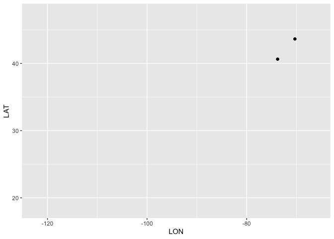
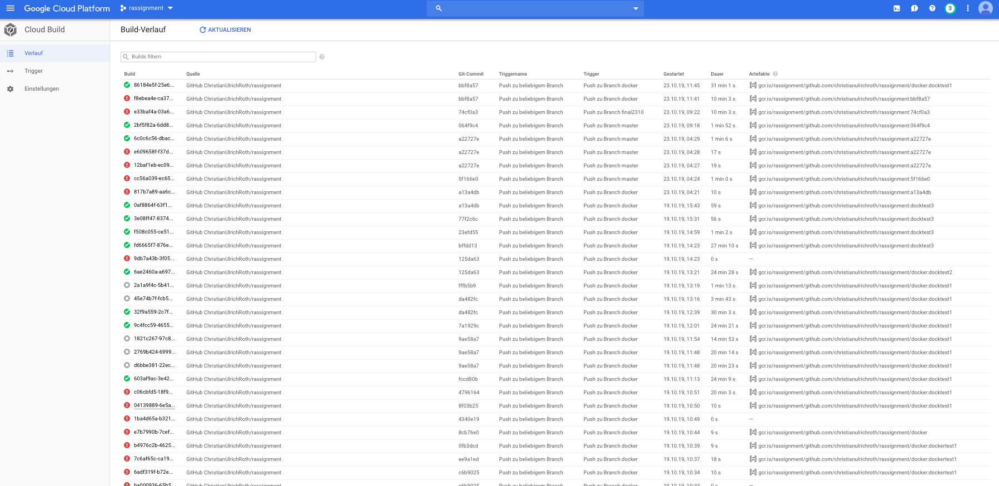
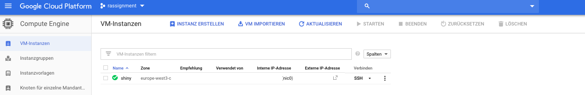

```{r setup, include=FALSE}
options(htmltools.dir.version = FALSE)
```

class: inverse

background-image:url(images/agenda_flugzeug.png)
background-position: 50% 50%
background-size: contain

# Flight Analysis Christmas15


---

# Übersicht

1. Data Prep der Flugdaten aus den USA aus dem Jahr 2015 
2. Data Exploration und Analyse der Verspätungen bei Airlines
3. Visualisierung in einem interaktiven Shiny-Dashboard
4. Animierten Karte mit Flugbewegungen
5. Deployment mit  Docker und in der Google-Cloud
6. Fazit


<font size="1"> Flughäfen USA, Image credit: https://www.kaggle.com/fabiendaniel/predicting-flight-delays-tutorial </font> 

---

# Vorstellung Datensatz und Data Prep 

* Flight Data 2015 von U.S. Department of Transportation's (DOT)
<font size="1"> Quelle: https://www.kaggle.com/fabiendaniel/predicting-flight-delays-tutorial/data</font> 

* 3 Datensätze: airlines.csv, airports.csv, flights.csv

* 5.819.079 Datensätze (=Flüge in der USA in 2015)

* Flüge an Weihnachten 2016 (23.12.-26.12.): 56.246

* Flüge am Christmas Day (25.12.): 1.299

---


# Data Preparation

.center[[](./Data_Prep_15.html)]

---

# Einblick in den Datensatz Flights 2015 

* Nach der Data Preparation sind noch 5.226.569 Obervationen im Datensatz. Das entspricht einer Reduktion von 10,2%.
* Mit den Daten können somit 90% der Flüge in den USA in 2015 betrachtet werden.
* Nach der ersten Analyse der Daten haben wir uns überlegt, die Pünktlichkeit im Rahmen der Projektarbeit herauszustellen.
* Dabei gehen wir davon aus, dass für Passagiere die pünktliche Ankunft am Zielort entscheidenter ist, als die Abflugsverspätung:

<font size="1"> Ankünftsverspätung je Airline, soriteirt nach Anzahl Flüge:</font>


---

# Plots zur Ankünftsverspätung

<font size="1"> Ankunftsverspätung und Distanz </font>

.center[]


<font size="1"> Ankunftsverspätung je Airline (links alle Flüge, rechts Flüge mit größer 10 min. Verspätung </font>

.pull-left[


]

.pull-right[

]

---

# Chrsitmas Data

Einbindung von Code

```{r include=FALSE}
```{r}
library(tidyverse)
library(readr)
library(DataExplorer)
```

```{r include=FALSE}
christmas15 <- read_csv( file=( "./data/cleandata/christmas15.csv"))
```


---
## QQ_plots

```{r}
qq_christmas15 <- christmas15[, c("ARRIVAL_DELAY", "AIR_TIME", "DISTANCE", "ELAPSED_TIME")]
plot_qq(qq_christmas15, sampled_rows = 1000L)
```
---

## Logarithmierte QQ-Plots

```{r}
log_qq_christmas15 <- update_columns(qq_christmas15, 2:4, function(x) log(x + 1))

plot_qq(log_qq_christmas15[, 2:4], sampled_rows = 1000L)
```

---
# Korrelationen

Im Datensatz gibt es einige Korrelationen die in einer tiefergehenden Analyse analysiert werden können.


---
# Auswertungen bei Christmas Data
.pull-left[
Abflugverspätung pro Tag


]


.pull-right[
Abflugverspätungen pro Airline


]

Mittelwert und Median (and Median (Abflug und Ankunft) für jeden Tag


---

class: inverse

# Visualisierungen in Dashboards


Manchmal sind einfache Instrumente zeitlos...

.center[]

---


# Visualisierung in Shiny

... doch oft bedarf es auch nach etwas Neuem:

.center[]

[Shiny](https://croth.shinyapps.io/shiny/)


---

# Animierte Karte mit Flugbewegungen

* Wir hatten die Aufgabe, eine Karte zu bauen, die Flugbewegungen in einer Region abbildet.

* Um eine Darstellung zu ermöglichen, mussten wir den Datensatz weiter reduzieren.

* Dazu wurde der Datensatz Chrsitmas Day gebaut.

* Dieser Datensatz beinhaltet alle Flugbewegungen (Anzahl 1.299) am 25.12. von und nach JFK

* Um die Karte besser zu veranschaulichen, wurde aus diesem Datensatz nochmal ein Stichprobe gezogen.

.center[]

---

background-image:url(images/usa_flights1.gif)
background-position: 50% 50%
background-size: contain

# Animierte Flugkarte JFK
---
# Entwicklungsstadien Flugkarte JFK

.pull-left[
Flugvektoren

]
.pull-right[
Flugbewegungen ohne Karte

]
---
# Deployment mit Docker und in der Google-Cloud

* In immer mehr Unternehmen werden Dashboards in einer Cloud-Umgebung gehostet
* Wir haben uns mit Docker beschäftigt und versucht, eine die Shiny-App in der Google-Cloud zu deployen.
* Ein erster Ansatz ist sehr viel versprechend und konnte erfolgreich implementiert werden. (Siehe Nachtrag) 


.pull-left[


]

.pull-right[

]


---

background-image:url(images/outlook.png)
background-position: 50% 50%
background-size: contain


# Fazit

* Sehr forderndes Modul, aber super interessantes Projekt

* Sehr viel Stoff zu verarbeiten, aber viel Neues gelernt

* Arbeien mit Github und iterative Entwicklungsarbeit

* Xaringan würde wahrscheinlich den Arbeitsalltag erleichtern

* Immer nur bis zum POC oder MVP denken

* Gerne wieder, dann aber in der Cloud und mit einem Vorhersage-Algorithmus, um Verspätungen in einem Dashboard zu prognostizieren.


---

# Nachtrag Deployment mit Docker und in der Google-Cloud

Ziel war es, unsere Shiny App in einem Docker Container in der Google Cloud zu deployen. 
Hierfür haben wir zunächst einen Account in der Google Cloud angelegt und entsprechende APIs aktiviert. 
In der Abbildung wird das Google Cloud Dashboard dargestellt. 


---
# Build Trigger

Um aus der Shiny App ein Build erstellen zu können, wird ein sogenannter Google Cloud Build Trigger implementiert. Dafür ist es notwendig, unseren Google Cloud Space mit unserem Github Account zu verbinden. Im Anschluss werden verschiedene Trigger in den unterschiedlichsten Ausprägungen getestet. 


---

# Trigger Details

In der nachfolgenden Abbildung ist ein Trigger dargestellt, welcher einen Build startet, sobald in Github Änderungen in den Branch "docker" gepusht werden. Dabei wird im Branch "docker" nach dem dafür notwendigen Buildfile (Dockerfile) gesucht, und die darin hinterlegte Installationsroutine gestartet. 


---

# Build History

In dieser Abbildung sind unsere durchgelaufenen Builds zu sehen. Ein Build basiert auf einem Dockerfile. 



---

# Build Details

Nachfolgend wird ein erfolgreiches Build-Image mit den dazugehörigen Informationen dargestellt.


---

# Digest Details

Das Build-Image ist direkt aufrufbar und enthält weitere Informationen. Aus diesem Image kann wiederum eine VM-Instanz erstellt werden. Dies ist sowohl manuell, als auch automatisiert möglich. 


---

# VM Instance Creation 

Wie in der Abbildung zu erkennen ist, wird die VM-Instanz auf Basis des zuvor erstellten Container-Image erstellt. Darüber hinaus müssen noch noch netzwerkrelevante Einstellungen vorgenommen werden. 


---

# Firewall Rules

Für den Aufruf des Shiny-Servers und des RStudio-Servers müssen die Ports 3838 und 8787 freigeschaltet werden. Nach der Implementierung unserer notwendigen Firewall-Regeln wird die dargestellte Shiny-Instanz aufrufbar sein. 


---

# VM Instances

Die nachfolgende Abbildung zeigt eine erfolgreich implementierte VM Instanz auf Basis eines Dockerimages.




---

# Shiny Server

Über die entsprechende IP-Adresse und des Ports 3838 kann der Shiny Server aufgerufen werden. 
Die unten stehende Abbildung zeigt, dass die Konfiguration erfolgreich war. 


---

# Shiny Demo Example App

It's alive! Wir sind nun in der Lage, unsere zukünftige Shiny App via Docker und Google Cloud zu exposen.


